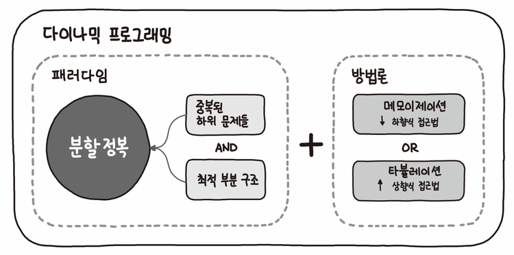

# **DP(Dynamic Programming) : 동적 계획법**



- 특정 범위까지의 값을 구하기 위해 그것과 다른 범위까지의 값을 이용하여 효율적으로 값을 구하는 알고리즘
- DP는 메모리를 적절히 사용하여 수행 시간을 비약적으로 증가시키는 방법이다.
- 주어진 문제의 부분 문제를 해결하여 결과값을 이용해 원래 문제의 답을 산출한다
  - 계산된 결과를 저장하여 같은 계산을 반복하지 않도록 하는것.
- DP의 구현은 일반적으로 두 가지 방식(탑다운, 바텀업)으로 구성된다

- 2가지를 만족하여야한다

  - 1. 최적부분구조(Optimal Substructure) : 작은문제의 답을 모아 큰문제를 해결
  - 2. 중복되는 부분(Overlapping Subproblem) : 동일한 작은 문제 반복

- 점화식 도출이 핵심

## DP 사용 조건

1. Overlapping Subproblems : 중복되는 부분 : 동일한 작은 문제들이 반복해서 나타나는 경우

2. Opimal Substrucure : 최적 부분 구조 : 부분 문제의 최적 결과 값을 사용해 전체 문제의 최적 결과를 낼수 있는 경우

## 풀이 순서

1. DP로 풀수 있는지 확인
2. 문제의 변수 파악
3. 변수 간 관계식(점화식)
4. 메모하기(memoization or tabulation)
5. 기저 상태 파악
6. 구현

```js
//* dy는 필수 : memoization
let dy = Array.form({ length: n + 1 }, () => 0);

//* 점화식 도출
dy[i] = dy[i - 2] + dy[i - 1];

//* 기저 상태 파악
dy[1] = 1;
dy[2] = 2;
```

## 구현 방법

1. Bottom-Up(Tabulation) : 반복문 사용
2. Top-Down(Memoization) : 재귀 사용

## Tabulation

- table-filling : dp[0] 부터 하나씩 채우는 과정
- table에 저장된 값에 직접 접근하여 재활용하므로 tabulation 이라는 명칭
- memoization과 크게 다르지 않다

## Memoization

## 최장 증가 부분 수열(LIS : Longest Increasing Subsequence)

## 냅색 알고리즘(Knapsack)

- DFS을 이용한 완전탐색에서 풀어봤었음

## Reference

- [다이나믹 프로그래밍 - 동빈나](https://www.youtube.com/watch?v=5Lu34WIx2Us)
- [Dynamic Programming(동적 계획법) - 겐지충 프로그래머](https://hongjw1938.tistory.com/47)
- [knapsack problem - 코드없는 프로그래밍](https://www.youtube.com/watch?v=rhda6lR5kyQ)
