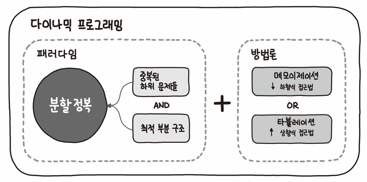

## Dynamic Programming(DP : 동적계획법)

- 특정 범위까지의 값을 구하기 위해 그것과 다른 범위까지의 값을 이용하여 효율적으로 값을 구하는 알고리즘

- 접근 방식이 분할 정복 알고리즘과 비슷

- 주어진 문제를 부분 문제의 답을 계산하고 계산한 결과값을 이용해 원래의 문제의 답을 산출



## DP 사용 조건

- 1.  Overlapping Subproblems(겹치는 부분문제)
- - 동일한 작은 문제들이 반복해서 나타나는 경우
- 2.  Optimal Substructure(최적 부분 구조)
- - 부분 문제의 최적 결과 값을 사용해 전체 문제의 최적 결과를 낼수 있는 경우

## DP 사용하기

- 1. DP로 풀수있는지 확인
- 2. 문제의 변수 파악
- 3. 변수 간 관계식 (점화식)
- 4. 메모하기(memoization or tabulation)
- 5. 기저 상태 파악
- 6. 구현

## 구현 방법

- 1. Bottom-Up(Tabulation) : 반복문 사용
- 2. Top-Down(Memoization) : 재귀 사용

```js
//* dy는 필수 : memoization
let dy = Array.form({ length: n + 1 }, () => 0);

//* 점화식 도출
dy[i] = dy[i - 2] + dy[i - 1];

//* 기저 상태 파악
dy[1] = 1;
dy[2] = 2;
```

## Tabulation

- table-filling : dp[0] 부터 하나씩 채우는 과정
- table에 저장된 값에 직접 접근하여 재활용하므로 tabulation 이라는 명칭
- memoization과 크게 다르지 않다

## 최장 증가 부분 수열(LIS : Longest Increasing Subsequence)

## 냅색 알고리즘(Knapsack)

- DFS을 이용한 완전탐색에서 풀어봤었음

## Reference

- [Dynamic Programming(동적 계획법) - 겐지충 프로그래머](https://hongjw1938.tistory.com/47)
- [knapsack problem - 코드없는 프로그래밍](https://www.youtube.com/watch?v=rhda6lR5kyQ)
